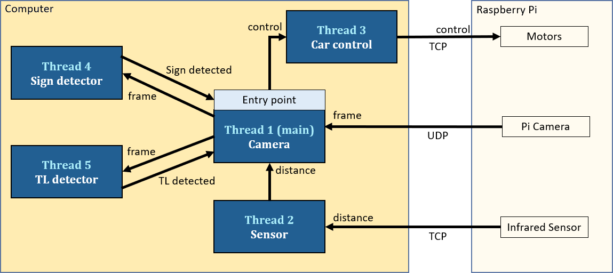
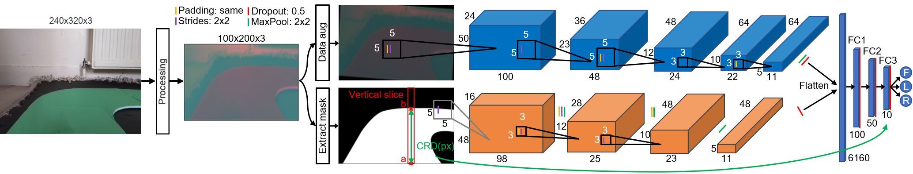
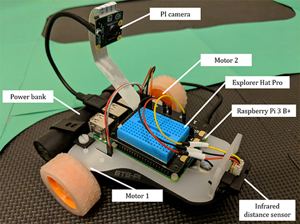

# Autonomous RC Car

MSc Artificial Intelligence thesis project (distinction 87%).

The project involves creating a miniature self-driving car using AI (TensorFlow), computer vision (OpenCV) and "robotics" (Raspberry Pi). The car can make its own decisions by observing its environment in real-time using an on-board camera and an infrared distance sensor. The car is placed in a dynamic environment, consisting of a configurable modular road system with intersections, road signs, traffic lights and obstacles. The road and interactions can be physically re-positioned on the fly to create an indefinite number of scenarios for the car to detect, comprehend, and tackle.

There is a research paper associated with this project, which can be found [here](readme_data/MSc_AI_Auto_RC_Car_paper.pdf).

# Demos

<table>
<tr>
    <th>Clip</th>
    <th>Note</th>
</tr>
<tr>
    <td width="600px">  </td>
    <td>
        The configurable road is made up using 3 modular pieces, which allows a large number of road layout variations to be easily made in a relatively small footprint. The different road layouts allows the model to be more generalisable and provides a more adjustable environment.
    </td>
</tr>
<tr>
    <td>  </td>
    <td>
        Autonomous driving forward in intersections. The car is able to maintain a central position on the lane consistently, independent of the road layout or road colour without twitchy movements. We can also observe that the car occasionally makes micro-steering adjustments to ensure that it stays central on the road as much as possible.
    </td>
</tr>
<tr>
    <td>  </td>
    <td>
        Using road signs to direct the car in the intersections. The car successfully detects and recognises the directional signs and takes the correct turn in the intersections.
    </td>
</tr>
<tr>
    <td>  </td>
    <td>
        Car interacting with traffic light. To determine when to stop when the light is red, a relative distance is obtained by using the number of pixels from the centre of the traffic light to the edge of the screen.
    </td>
</tr>
<tr>
    <td>  </td>
    <td>
        Obstacle avoidance. An infrared distance sensor is used to obtain the distance to objects directly in front of the car.
    </td>
</tr>
</table>

[Long video demo](https://youtu.be/JC426WmcdUs).

# Data flow

- In summary, the camera frame from the Raspberry Pi is sent to the computer (access to a more powerful GPU) for data processing and inference, then motor controls are sent back to the Raspberry Pi to drive the car appropriately.
- There are 5 threads in total, each major task is run on its own thread to ensure no network interference between data and to prevent bottleneck from a single task. For example, if there is no sensor data received successfully we still want to continue driving the car safely using the other data and not stop.
- It all starts on the computer in thread 1, where the computer awaits for a camera frame from the Raspberry Pi.
- Once a frame is received, thread 1 shares the frame with the threads that need it, thread 4 (sign detector) and thread 5 (traffic light detector), which goes through processing and inference and sends their results to the main thread (thread 1).
- In the main thread, the camera frame is used to get a steering control using the [autonomous driving pipeline](#autonomous-driving-pipeline), alongside any other data processing required from the other threads.
- Then using thread 3, the controls are sent to the Raspberry Pi to tell the motors what to do, which ultimately drives the car.
- This is repeated and performed at ~30 FPS.

# Autonomous driving pipeline

- This is the pipeline used for the car steering which is what makes the car autonomous.
- The frame first goes through processing, which is then fed into two separate models.
- For the top model, it uses the processed frame directly with data augmentations applied during training.
- For the bottom model, first the road mask is obtained which is what is used as the input for the bottom model.
- At the end of each model, they are both flattened and concatenated to go through fully connected layers.
- In addition to the features extracted by the two models, another feature is used to help the model with the prediction, which is the central road distance. It's pretty much the middle length of the road (white pixels), this distance is illustrated by the green arrow in the masked road frame.
- This value is concatenated in the last fully connected layer as an additional feature.
- Finally a prediction is made whether the car should steer left or right, or move forward.

More details can be found in the [paper](/readme_data/MSc_AI_Auto_RC_Car_paper.pdf) (page 5).

# How to run

## Step  1 - Hardware components required

There are two options:

1. Use only the minimum hardware required, which is a Raspberry Pi (any version) and a PiCamera connected to it. This will only allow you to stream the camera frames to the computer at your chosen resolution and FPS.

2. To produce the exact same results and be able run everything, below is all the hardware components you will need:

| Component                        | Purpose                 | Cost (£) |
|----------------------------------|-------------------------|----------|
| Raspberry Pi 4 Model B - 8GB RAM | Microcomputer           | 73.50    |
| Explorer HAT Pro                 | H-Bridge & Analog input | 20.40    |
| Raspberry   Pi Camera v2.1       | Camera                  | 24.21    |
| Sharp IR GP2Y0A41SK0F            | Distance sensor         | 8.99     |
| STS-Pi Roving Robot              | Chassis & Motors        | 27.90    |
| Poweradd EnergyCell 5000mAh      | Power supply            | 12.00    |
| Total cost                       |                         | 167.00   |

Visual view of the hardware setup:

## Step 2 - Setup

- On the pc, install dependencies using `pip install -r .\requirements.txt`.
- On the Raspberry Pi, install the Explorer Hat package using `pip install explorerhat==0.5.1`.

## Step 3 - To run

1. Change appropriate parameters (capital variable names) in `main.py` if needed.
2. Run `main.py` on the pc, this will display your pc local IP address for convenience.
3. Change the `host_ip` to the one obtained from the previous step in `/on_raspberrypi/cam_client.py`, then run it on the Raspberry Pi to establish the camera connection.
    - You should now see the live camera feed on the computer.
    - You can specify the resolution and FPS in `/on_raspberrypi/cam_client.py`.
4. Change the `host_ip` in `sensor_controller_client.py`, then run it on the Raspberry Pi to establish the sensor and control connections.
5. See keyboard shortcuts below.
6. For anything else, each directory has its own readme file that you can refer to.

## Keyboard shortcuts

`[q]` Quit program. 
`[a]` Toggle between autonomous mode and manual driving. 
`[Arrow keys]` Control car manually. 
`[#]` Stop the car. 
`[c]` Capture and save current frame/image. 
`[p]` Pause/unpause data collection. 
`[s]` Save data collected. 
`[r]` Reset/delete currently collected data. 
`[i]` Information regarding current data collection state 
`[1]`, `[2]`, `[3]` To choose which steering direction mode to collect data for (forward, left, right). Note that if not in data collection mode, they will be used to change which model to use for autonomous driving. 
`[0]` Add one lap, used to track what lap you are in when collecting data for convenience. 
`[-]` Reset the laps done to zero. 
